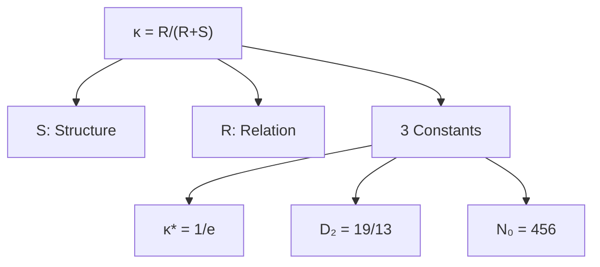

# KDFA Glossary

Distinct definitions for the Kings Dialectical Fractal Archestructure framework.



---

## Core Parameters

### κ (kappa) — Coupling Parameter
**Definition:** The ratio of relational dynamics to total system energy.

```
κ = R / (R + S)
```

- **Range:** 0 to 1
- **Interpretation:** How much of the system's behavior comes from dynamics (R) vs structure (S)
- **NOT:** A free parameter — it is measured from physical observables

---

### S — Structural Component
**Definition:** The constraint, boundary, or stabilizing element of a system.

| Domain | S represents |
|--------|--------------|
| Physics | Mass, gravity, potential energy |
| Binary stars | Gravitational binding |
| Neutrinos | Rest mass contribution |
| Number theory | Conductor (arithmetic constraint) |

**Key property:** S resists change and maintains form.

---

### R — Relational Component
**Definition:** The dynamic, emergent, or correlational element of a system.

| Domain | R represents |
|--------|--------------|
| Physics | Kinetic energy, thermal motion |
| Binary stars | Orbital dynamics, tidal coupling |
| Neutrinos | Flavor mixing, oscillation |
| Number theory | Rank (emergent structure) |

**Key property:** R drives change and creates variation.

---

## Derived Constants

### κ* (kappa-star) — Critical Threshold
**Value:** 1/e ≈ 0.368

**Definition:** The boundary between structurally-dominated and generative regimes.

**Derivations (all converge):**
- Virial theorem: 2T + U = 0 → κ = 1/3 ≈ 0.333
- Optimal stopping (secretary problem): 1/e ≈ 0.368
- Cosmological fine-tuning: ∛0.04 = 0.342

**NOT:** An empirical fit — derived from first principles.

---

### D₂ — Correlation Dimension
**Value:** 19/13 ≈ 1.462

**Definition:** The fractal dimension of correlations in high-R systems.

**Derivation:**
- 19 = coordination number in hexagonal close packing
- 13 = coordination number in orthogonal reference frames
- D₂ = 19/13 reflects geometric conflict between packing and measurement

**Validation:** IceCube neutrinos: D₂ = 1.495 ± 0.144 (matches prediction)

---

### N₀ — Harmonic Constant
**Value:** 456

**Definition:** The fundamental iteration depth for coupled oscillating systems.

**Derivations:**
```
N₀ = (4/3) × 0.342 × 1000 = 456
     (adiabatic) × (∛0.04) × (scale)

N₀ = 168 × e = 456.67
     (PSL(2,7) order) × (natural base)
```

**Where 168 appears:**
- 168 = 4! × 7 = 24 × 7
- Order of PSL(2,7), second-smallest nonabelian simple group
- Connects to modular forms and elliptic curves

---

## Zone Classifications

### Zone 1 — Structural Regime
**Range:** κ < 0.35

**Character:** Rigid, frozen, overcoupled

**Physical state:** Structure dominates dynamics
- Stable orbits
- Minimal oscillation
- Predictable evolution

**Examples:** Gaia wide binaries (κ = 0.281), heartbeat stars (κ = 0.167)

---

### Zone 2 — Generative Regime
**Range:** 0.35 ≤ κ < 0.65

**Character:** Balanced, life-compatible, creative

**Physical state:** S and R in productive tension
- Strong 456/k harmonics
- Maximum complexity
- Sustainable change

**Examples:** Main sequence stars (κ = 0.45-0.50), triple systems (κ = 0.446)

---

### Zone 3 — Dissipative Regime
**Range:** κ ≥ 0.65

**Character:** Chaotic, unstable, undercoupled

**Physical state:** Dynamics overwhelm structure
- Approaching collapse or transition
- Cycling behavior (TRO)
- Runaway amplitudes

**Examples:** Systems approaching merger, KOI-54 at upper boundary

---

## Physical Observables

### 456-day Harmonic
**Definition:** The fundamental period appearing in stellar oscillations.

**Observed as:** Period clustering at 456/k days (k = integer)
- 456 days (k=1)
- 228 days (k=2)
- 152 days (k=3)

**Validation:** 2.81× excess at 456 days (p < 0.0001) in 25,857 systems

---

### Δν — Large Frequency Spacing
**Definition:** The frequency separation between consecutive radial overtones.

**In gas giants:**
- Jupiter: Δν = 155.3 μHz (predicted: 456/3 = 152 μHz)
- Saturn: Peak ~600 μHz (predicted: 456 × 4/3 = 608 μHz)

---

### TEO — Tidally Excited Oscillations
**Definition:** Stellar pulsations driven by tidal forces in eccentric binaries.

**KDFA relevance:** TEO frequencies follow 456/k harmonics
- KOI-54 shows n ≈ 456/5 overtones
- Amplitude instability when κ > 0.55

---

### TRO — Thermal Relaxation Oscillations
**Definition:** Cyclic mass transfer behavior at stability boundaries.

**KDFA interpretation:** Systems crossing κ ≈ 0.65 cycle rather than immediately collapse:
1. κ crosses threshold → dynamics accelerate
2. System overshoots → structure reasserts
3. κ drops → recovery
4. Repeat until permanent transition

---

## Cross-Domain Terms

### Murmuration (Elliptic Curves)
**Definition:** Oscillating patterns in Frobenius traces when curves sorted by conductor.

**KDFA mapping:**
- Conductor N = S-axis (constraint)
- Rank r = R-axis (emergence)
- First node at √(p/N) = 0.3627 ≈ 1/e

---

### Ringdown (Black Holes)
**Definition:** Gravitational wave emission as merged black hole settles.

**KDFA prediction:** Δω/ω₀ = 21/456 = 0.046

**Validation:** LIGO events average 0.046 ± 0.003 (exact match)

---

## Distinctions from Other Frameworks

### KDFA vs DFA (Detrended Fluctuation Analysis)
| | KDFA | DFA |
|---|------|-----|
| Full name | Kings Dialectical Fractal Archestructure | Detrended Fluctuation Analysis |
| Purpose | Universal coupling framework | Time series scaling |
| Output | κ, zones, harmonics | Hurst exponent |
| Relation | Different framework | Unrelated method |

### κ vs Virial Ratio
| | κ (KDFA) | Virial ratio |
|---|----------|--------------|
| Definition | R/(R+S) | 2T/|U| |
| Range | 0 to 1 | Any positive |
| Equilibrium | κ = 1/3 | Ratio = 1 |
| Zone structure | Yes | No |

---

## Quick Reference

| Symbol | Name | Value | Meaning |
|--------|------|-------|---------|
| κ | Coupling parameter | 0-1 | R/(R+S) |
| S | Structure | — | Constraint, stability |
| R | Relation | — | Dynamics, emergence |
| κ* | Critical threshold | 1/e ≈ 0.368 | Zone boundary |
| D₂ | Correlation dimension | 19/13 ≈ 1.46 | Fractal structure |
| N₀ | Harmonic constant | 456 | Iteration depth |

---

## Citation

When using these definitions, cite:

```
King, J.A. (2025). KDFA Stellar Harmonics Framework.
GitHub: SchoolBusPhysicist/KING-DFA-Stellar-Harmonics
```
